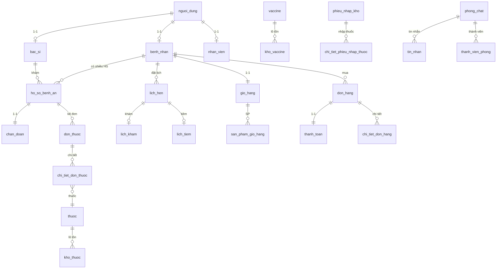

# Cơ sở dữ liệu — Hệ thống phòng khám

Tài liệu tổng hợp **cấu hình DB**, **danh sách bảng**, **quan hệ**, **mã Django models** và **giải thích nghiệp vụ** cho dự án `phongkham_system`.

---

## 1. Tổng quan

| Hạng mục | Giá trị |
|----------|---------|
| Hệ quản trị CSDL | **MySQL** (utf8mb4) |
| ORM | **Django** — models trong `be/<app>/models.py` |
| Tài khoản đăng nhập | `AUTH_USER_MODEL = 'nguoidung.NguoiDung'` → bảng `nguoi_dung` |
| Múi giờ | `Asia/Ho_Chi_Minh` |
| Khóa chính phổ biến | `UUID` (hầu hết bảng nghiệp vụ) |

### Cấu hình kết nối (`be/phongkham/settings.py`)

```python
DATABASES = {
    'default': {
        'ENGINE': 'django.db.backends.mysql',
        'NAME': os.environ.get('DB_NAME', 'phongkham'),
        'USER': os.environ.get('DB_USER', 'root'),
        'PASSWORD': os.environ.get('DB_PASSWORD', ''),
        'HOST': os.environ.get('DB_HOST', 'localhost'),
        'PORT': os.environ.get('DB_PORT', '3306'),
        'OPTIONS': {
            'charset': 'utf8mb4',
            'init_command': "SET sql_mode='STRICT_TRANS_TABLES'",
        }
    }
}
AUTH_USER_MODEL = 'nguoidung.NguoiDung'
```

### Các app Django (mỗi app = một nhóm bảng)

| App | Thư mục models | Chức năng chính |
|-----|----------------|-----------------|
| `nguoidung` | `be/nguoidung/models.py` | Người dùng, bệnh nhân, bác sĩ, nhân viên, audit |
| `benhan` | `be/benhan/models.py` | Hồ sơ bệnh án, chẩn đoán, đơn thuốc, tiêm chủng |
| `lichhen` | `be/lichhen/models.py` | Đặt lịch, khám, tiêm, nhắc nhở |
| `thuoc` | `be/thuoc/models.py` | Thuốc, vaccine, kho, nhập kho |
| `donhang` | `be/donhang/models.py` | Giỏ hàng, đơn mua thuốc, thanh toán |
| `trochuyen` | `be/trochuyen/models.py` | Chat / tư vấn |
| `thongbao` | `be/thongbao/models.py` | Thông báo in-app (app riêng) |
| `baocao` | `be/baocao/models.py` | Báo cáo thống kê |

**Lưu ý:** Có **hai** hệ thống thông báo:
- `nguoidung_thong_bao` — model `nguoidung.ThongBao` (theo loại: lịch hẹn, đơn thuốc, …)
- `thong_bao_app` — model `thongbao.ThongBao` (app `thongbao`, có `lien_ket` URL)

Ngoài ra Django tạo thêm bảng hệ thống: `django_migrations`, `auth_*`, `django_session`, JWT blacklist (`token_blacklist_*`), v.v.

---

## 2. Sơ đồ quan hệ (tóm tắt)



---

## 3. Luồng nghiệp vụ chính

### 3.1. Người dùng & phân quyền

1. Mọi người đăng nhập qua bảng **`nguoi_dung`** (`ten_dang_nhap`, `vai_tro`: `BENH_NHAN` | `BAC_SI` | `NHAN_VIEN` | `ADMIN`).
2. Mỗi vai trò có bảng mở rộng **1-1**:
   - Bệnh nhân → `benh_nhan` (mã `BN{YYYY}{0001}`, BHYT, tiền sử…)
   - Bác sĩ → `bac_si` (mã `BS{YYYY}{0001}`, chuyên khoa, lịch JSON…)
   - Nhân viên → `nhan_vien` (mã `NV{YYYY}{0001}`, chức vụ, `quyen_han` JSON)

### 3.2. Khám bệnh

1. **`lich_hen`** — đặt lịch (khám / tiêm / tái khám / tư vấn), trạng thái từ `CHO_XAC_NHAN` → `HOAN_THANH`.
2. Khi khám: **`lich_kham`** (1-1 với `lich_hen`) hoặc tạo trực tiếp **`ho_so_benh_an`** (mã `HS{YYYYMM}{0001}`).
3. **`chan_doan`** (1-1 với hồ sơ): ICD-10, mức độ, phương pháp điều trị.
4. **`don_thuoc`** + **`chi_tiet_don_thuoc`**: kê thuốc từ kho hoặc đánh dấu *mua ngoài* (`la_thuoc_mua_ngoai`).
5. Xuất kho: **`phieu_xuat_thuoc`** + **`chi_tiet_xuat_thuoc`** (gắn `kho_thuoc` theo lô).

### 3.3. Tiêm chủng

- Lịch: **`lich_tiem`** (gắn `lich_hen` + `vaccine`).
- Lịch sử thực tế: **`lich_su_tiem_chung`** (mã `TC{YYYY}{000001}`).

### 3.4. Mua thuốc (online / quầy)

1. **`gio_hang`** (1 bệnh nhân — 1 giỏ) → **`san_pham_gio_hang`**.
2. **`don_hang`** → **`chi_tiet_don_hang`**; thanh toán qua **`thanh_toan`** (VNPay, tiền mặt, …).
3. Có thể liên kết **`benhan.DonThuoc`** nếu bán theo toa bác sĩ.
4. **`lich_su_don_hang`**: audit đổi trạng thái đơn.

### 3.5. Kho dược & vaccine

- Danh mục: **`thuoc`**, **`vaccine`** (+ loại, đơn vị, NCC).
- Tồn theo **lô**: **`kho_thuoc`**, **`kho_vaccine`** (HSD, `lo_sx`, vị trí).
- Nhập: **`phieu_nhap_kho`** + chi tiết thuốc/vaccine; cờ `da_cap_nhat_kho`, `da_duyet_chi`.

---

## 4. Danh sách bảng theo module

### 4.1. `nguoidung` — Người dùng

#### `nguoi_dung` — Tài khoản hệ thống (Custom User)

| Cột | Kiểu | Mô tả |
|-----|------|--------|
| `id` | UUID PK | Khóa chính |
| `ten_dang_nhap` | VARCHAR(150) UNIQUE | Đăng nhập |
| `email` | VARCHAR UNIQUE | Email |
| `password` | VARCHAR | Hash mật khẩu (AbstractBaseUser) |
| `ho_ten`, `so_dien_thoai` | VARCHAR | Thông tin cá nhân |
| `vai_tro` | VARCHAR(20) | BENH_NHAN / BAC_SI / NHAN_VIEN / ADMIN |
| `avatar` | Image | Ảnh đại diện |
| `cccd` | VARCHAR(12) UNIQUE | Căn cước |
| `is_active`, `is_staff`, `is_superuser` | BOOL | Django auth |
| `is_locked`, `locked_until`, `login_attempts` | | Chống brute-force |
| `deleted_at` | DATETIME | Soft delete |

**Code (rút gọn):**

```python
class NguoiDung(AbstractBaseUser, PermissionsMixin):
    id = models.UUIDField(primary_key=True, default=uuid.uuid4, editable=False)
    ten_dang_nhap = models.CharField(max_length=150, unique=True, db_index=True)
    email = models.EmailField(unique=True)
    vai_tro = models.CharField(max_length=20, choices=VAI_TRO_CHOICES)
    # ...
    class Meta:
        db_table = 'nguoi_dung'
    USERNAME_FIELD = 'ten_dang_nhap'
```

#### `benh_nhan` — Hồ sơ bệnh nhân

| Cột | Mô tả |
|-----|--------|
| `nguoi_dung_id` | PK + FK → `nguoi_dung` (OneToOne) |
| `ma_benh_nhan` | Mã BN (unique) |
| `ngay_sinh`, `gioi_tinh`, `dia_chi` | Nhân khẩu |
| `so_bao_hiem`, `ngay_het_han_bhyt` | BHYT |
| `nhom_mau`, `chieu_cao`, `can_nang` | Sinh lý |
| `tien_su_benh`, `tien_su_di_ung` | Y khoa |

#### `bac_si` — Hồ sơ bác sĩ

| Cột | Mô tả |
|-----|--------|
| `nguoi_dung_id` | PK + FK OneToOne |
| `ma_bac_si`, `chuyen_khoa`, `so_giay_phep` | Nghề nghiệp |
| `trinh_do`, `chuc_vu`, `lich_lam_viec` | JSON lịch tuần |
| `is_working` | Đang công tác |

#### `nhan_vien` — Nhân viên phòng khám

| Cột | Mô tả |
|-----|--------|
| `ma_nhan_vien`, `phong_ban`, `chuc_vu` | LE_TAN, KHO, BAN_THUOC, … |
| `quyen_han` | JSON quyền theo chức vụ |

#### `lich_su_kham_benh`

Lịch sử khám tóm tắt: `benh_nhan`, `bac_si`, `ngay_kham`, `chuan_doan`, `ket_luan`.

#### `danh_gia_bac_si`

Điểm 1–5, `unique_together`: (`benh_nhan`, `bac_si`, `ho_so`).

#### `nguoidung_thong_bao`

Thông báo gửi `nguoi_nhan`, `loai`, `da_xem`, `du_lieu_lien_quan` (JSON).

#### `lich_lam_viec`

Slot làm việc theo ngày/giờ của `nguoi_dung`; `unique_together`: (`nguoi_dung`, `ngay`, `gio_bat_dau`).

#### `nhat_ky_hoat_dong`

Audit: `hanh_dong`, `doi_tuong`, `du_lieu_cu`/`du_lieu_moi` (JSON), IP, user agent.

---

### 4.2. `benhan` — Bệnh án & đơn thuốc

| Bảng | Quan hệ chính | Mô tả |
|------|---------------|--------|
| `ho_so_benh_an` | FK `benh_nhan`, `bac_si` | Phiếu khám: triệu chứng, sinh hiệu, `ma_hs` |
| `chan_doan` | OneToOne `ho_so_benh_an` | ICD-10, mức độ, kết luận |
| `don_thuoc` | FK `ho_so`, `benh_nhan` | Đơn thuốc, thanh toán, BHYT |
| `chi_tiet_don_thuoc` | FK `don_thuoc`, `thuoc` | Liều, cách dùng, giá tại thời điểm |
| `phieu_xuat_thuoc` | OneToOne `don_thuoc` | Phiếu xuất kho |
| `chi_tiet_xuat_thuoc` | FK `phieu_xuat`, `kho_thuoc` | Xuất theo lô |
| `lich_su_tiem_chung` | FK `benh_nhan`, `vaccine` | Mũi tiêm, phản ứng |
| `toa_thuoc_mau_benhan` | FK `bac_si_tao` | Toa mẫu (module benhan) |
| `benhan_chi_tiet_toa_mau` | FK toa + thuốc | Chi tiết toa mẫu benhan |
| `lich_hen_tai_kham` | FK `ho_so`, `bac_si` | Hẹn tái khám từ hồ sơ |
| `theo_doi_dieu_tri` | FK `ho_so` | Diễn biến, chỉ số JSON |

**Mã tự sinh:**

| Đối tượng | Prefix ví dụ |
|-----------|----------------|
| Hồ sơ | `HS2026050001` |
| Đơn thuốc | `DT2026050001` |
| Phiếu xuất | `PX2026050001` |
| Lịch tiêm | `TC2026000001` |
| Hẹn tái khám | `LH2026000001` |

**Code mẫu — Hồ sơ bệnh án:**

```python
class HoSoBenhAn(models.Model):
    id = models.UUIDField(primary_key=True, default=uuid.uuid4, editable=False)
    ma_hs = models.CharField(max_length=50, unique=True, blank=True)
    benh_nhan = models.ForeignKey(BenhNhan, on_delete=models.CASCADE, related_name='ho_so')
    bac_si = models.ForeignKey(BacSi, on_delete=models.SET_NULL, null=True)
    ly_do_kham = models.TextField()
    trieu_chung = models.TextField()
    huyet_ap = models.CharField(max_length=20, blank=True)
    trang_thai = models.CharField(max_length=20, choices=TRANG_THAI_CHOICES, default='DANG_DIEU_TRI')
    class Meta:
        db_table = 'ho_so_benh_an'
```

---

### 4.3. `lichhen` — Lịch hẹn

| Bảng | Mô tả |
|------|--------|
| `lich_hen` | Lịch trung tâm: BN, BS, loại, giờ, phòng, STT, thanh toán |
| `lich_kham` | PK = `lich_hen_id`: lý do, triệu chứng, link `ho_so_benh_an` |
| `lich_tiem` | PK = `lich_hen_id`: vaccine, mũi, trạng thái tiêm |
| `lich_su_lich_hen` | Audit đổi trạng thái lịch |
| `nhac_nho_lich_hen` | SMS / Email / Push / Zalo |
| `danh_gia_dich_vu` | OneToOne `lich_hen`: điểm dịch vụ |

**Trạng thái `lich_hen`:** `CHO_XAC_NHAN` → `DA_XAC_NHAN` → `CHECKED_IN` → `DANG_KHAM` → `HOAN_THANH` (hoặc `DA_HUY`, `VANG_MAT`).

**Mã lịch:** `LH{YYMM}{0001}` (ví dụ `LH26050001`).

---

### 4.4. `thuoc` — Dược & vaccine

| Bảng | Mô tả |
|------|--------|
| `loai_thuoc`, `don_vi_tinh` | Danh mục phụ |
| `nha_cung_cap` | NCC (`ma_ncc`, MST, liên hệ) |
| `thuoc` | Danh mục thuốc: giá nhập/bán, `can_don_thuoc`, M2M NCC qua `thuoc_nha_cung_cap` |
| `kho_thuoc` | Tồn theo lô + HSD |
| `lich_su_gia_thuoc` | Audit đổi giá |
| `loai_vaccine`, `vaccine` | Danh mục vaccine |
| `kho_vaccine` | Tồn vaccine theo lô |
| `lich_su_gia_vaccine` | Audit giá vaccine |
| `phieu_nhap_kho` | Phiếu nhập THUOC/VACCINE |
| `chi_tiet_phieu_nhap_thuoc` | Dòng nhập thuốc |
| `chi_tiet_phieu_nhap_vaccine` | Dòng nhập vaccine |
| `thuoc_toa_thuoc_mau` | Toa mẫu (module thuoc — khác `toa_thuoc_mau_benhan`) |
| `thuoc_chi_tiet_toa_mau` | Chi tiết toa thuoc |

**Mã tự sinh:** thuốc `TH{YYYY}{0001}`, vaccine `VC{YYYY}{0001}`.

**Code mẫu — Kho thuốc:**

```python
class KhoThuoc(models.Model):
    id = models.UUIDField(primary_key=True, default=uuid.uuid4, editable=False)
    thuoc = models.ForeignKey(Thuoc, on_delete=models.CASCADE, related_name='kho_thuoc')
    so_luong = models.IntegerField(default=0)
    ngay_nhap = models.DateField()
    han_su_dung = models.DateField()
    lo_sx = models.CharField(max_length=100, blank=True)
    class Meta:
        db_table = 'kho_thuoc'
```

---

### 4.5. `donhang` — Đơn hàng & thanh toán

| Bảng | Mô tả |
|------|--------|
| `gio_hang` | OneToOne `benh_nhan` |
| `san_pham_gio_hang` | FK giỏ + `thuoc`, `don_gia_tai_thoi_diem` |
| `don_hang` | Đơn ONLINE/TAI_QUAY, duyệt thuốc đặc biệt |
| `chi_tiet_don_hang` | Dòng đơn, có thể link `chi_tiet_don_thuoc` |
| `lich_su_don_hang` | Audit trạng thái (immutable) |
| `thanh_toan` | OneToOne `don_hang`: VNPAY, tiền mặt, … |

**Trạng thái đơn:** `MOI_TAO` → `CHO_THANH_TOAN` → `DA_THANH_TOAN` → `DANG_CHUAN_BI` → `DANG_GIAO` → `HOAN_THANH`.

---

### 4.6. `trochuyen` — Chat

| Bảng | Mô tả |
|------|--------|
| `phong_chat` | Phòng TU_VAN / HOI_CHAN / HEN_LICH / HOI_DAP |
| `thanh_vien_phong` | Ai trong phòng, vai trò, active |
| `tin_nhan` | TEXT, FILE, THUOC, LICH_HEN, BENH_AN, … |
| `tin_nhan_da_xem` | Đã đọc theo từng user (group chat) |

---

### 4.7. `thongbao` — Thông báo (app)

#### `thong_bao_app`

| Cột | Mô tả |
|-----|--------|
| `nguoi_nhan_id` | FK → `nguoi_dung` |
| `loai_thong_bao` | LICH_HEN, DON_HANG, TIN_NHAN, HE_THONG, THANH_TOAN |
| `da_doc_luc` | NULL = chưa đọc |
| `lien_ket` | URL điều hướng |

---

### 4.8. `baocao` — Báo cáo

| Bảng | Mô tả |
|------|--------|
| `bao_cao` | Báo cáo đã tạo: loại, khoảng ngày, `du_lieu` JSON |
| `mau_bao_cao` | Template tái sử dụng, `tham_so` JSON |

---

## 5. SQL tham khảo (MySQL)

Schema thực tế do Django migrations sinh ra. Dưới đây là **DDL tham khảo** cho các bảng lõi (rút gọn cột).

```sql
-- Tạo database
CREATE DATABASE IF NOT EXISTS phongkham
  CHARACTER SET utf8mb4 COLLATE utf8mb4_unicode_ci;
USE phongkham;

-- Người dùng
CREATE TABLE nguoi_dung (
    id CHAR(32) NOT NULL PRIMARY KEY,
    ten_dang_nhap VARCHAR(150) NOT NULL UNIQUE,
    email VARCHAR(254) NOT NULL UNIQUE,
    password VARCHAR(128) NOT NULL,
    ho_ten VARCHAR(255) NOT NULL,
    so_dien_thoai VARCHAR(15) NOT NULL,
    vai_tro VARCHAR(20) NOT NULL,
    is_active TINYINT(1) NOT NULL DEFAULT 1,
    is_staff TINYINT(1) NOT NULL DEFAULT 0,
    is_superuser TINYINT(1) NOT NULL DEFAULT 0,
    ngay_tao DATETIME(6) NOT NULL,
    ngay_cap_nhat DATETIME(6) NOT NULL,
  deleted_at DATETIME(6) NULL,
    INDEX idx_nguoi_dung_vai_tro (vai_tro)
) ENGINE=InnoDB DEFAULT CHARSET=utf8mb4;

CREATE TABLE benh_nhan (
    nguoi_dung_id CHAR(32) NOT NULL PRIMARY KEY,
    ma_benh_nhan VARCHAR(20) NOT NULL UNIQUE,
    ngay_sinh DATE NOT NULL,
    gioi_tinh VARCHAR(10) NOT NULL,
    dia_chi LONGTEXT NOT NULL,
    so_bao_hiem VARCHAR(50) NULL,
    CONSTRAINT fk_benh_nhan_nguoi_dung
        FOREIGN KEY (nguoi_dung_id) REFERENCES nguoi_dung(id) ON DELETE CASCADE
) ENGINE=InnoDB DEFAULT CHARSET=utf8mb4;

CREATE TABLE bac_si (
    nguoi_dung_id CHAR(32) NOT NULL PRIMARY KEY,
    ma_bac_si VARCHAR(20) NOT NULL UNIQUE,
    chuyen_khoa VARCHAR(100) NOT NULL,
    so_giay_phep VARCHAR(50) NOT NULL UNIQUE,
    CONSTRAINT fk_bac_si_nguoi_dung
        FOREIGN KEY (nguoi_dung_id) REFERENCES nguoi_dung(id) ON DELETE CASCADE
) ENGINE=InnoDB DEFAULT CHARSET=utf8mb4;

-- Hồ sơ & đơn thuốc
CREATE TABLE ho_so_benh_an (
    id CHAR(32) NOT NULL PRIMARY KEY,
    ma_hs VARCHAR(50) NULL UNIQUE,
    benh_nhan_id CHAR(32) NOT NULL,
    bac_si_id CHAR(32) NULL,
    ly_do_kham LONGTEXT NOT NULL,
    trieu_chung LONGTEXT NOT NULL,
    trang_thai VARCHAR(20) NOT NULL DEFAULT 'DANG_DIEU_TRI',
    ngay_kham DATETIME(6) NOT NULL,
    CONSTRAINT fk_hs_benh_nhan FOREIGN KEY (benh_nhan_id) REFERENCES benh_nhan(nguoi_dung_id),
    CONSTRAINT fk_hs_bac_si FOREIGN KEY (bac_si_id) REFERENCES bac_si(nguoi_dung_id)
) ENGINE=InnoDB DEFAULT CHARSET=utf8mb4;

CREATE TABLE don_thuoc (
    id CHAR(32) NOT NULL PRIMARY KEY,
    ma_don VARCHAR(50) NULL UNIQUE,
    ho_so_id CHAR(32) NOT NULL,
    benh_nhan_id CHAR(32) NOT NULL,
    trang_thai VARCHAR(20) NOT NULL DEFAULT 'CHO_XAC_NHAN',
    tong_tien DECIMAL(12,2) NOT NULL DEFAULT 0,
    CONSTRAINT fk_dt_ho_so FOREIGN KEY (ho_so_id) REFERENCES ho_so_benh_an(id),
    CONSTRAINT fk_dt_benh_nhan FOREIGN KEY (benh_nhan_id) REFERENCES benh_nhan(nguoi_dung_id)
) ENGINE=InnoDB DEFAULT CHARSET=utf8mb4;

-- Lịch hẹn
CREATE TABLE lich_hen (
    id CHAR(32) NOT NULL PRIMARY KEY,
    ma_lich_hen VARCHAR(20) NULL UNIQUE,
    benh_nhan_id CHAR(32) NOT NULL,
    bac_si_id CHAR(32) NULL,
    loai_lich VARCHAR(20) NOT NULL,
    ngay_gio_hen DATETIME(6) NOT NULL,
    trang_thai VARCHAR(20) NOT NULL DEFAULT 'CHO_XAC_NHAN',
    CONSTRAINT fk_lh_benh_nhan FOREIGN KEY (benh_nhan_id) REFERENCES benh_nhan(nguoi_dung_id)
) ENGINE=InnoDB DEFAULT CHARSET=utf8mb4;

-- Thuốc & kho
CREATE TABLE thuoc (
    id CHAR(32) NOT NULL PRIMARY KEY,
    ma_thuoc VARCHAR(50) NOT NULL UNIQUE,
    ten_thuoc VARCHAR(255) NOT NULL,
    loai_thuoc_id CHAR(32) NOT NULL,
    don_vi_id CHAR(32) NOT NULL,
    gia_ban DECIMAL(10,2) NOT NULL
) ENGINE=InnoDB DEFAULT CHARSET=utf8mb4;

CREATE TABLE kho_thuoc (
    id CHAR(32) NOT NULL PRIMARY KEY,
    thuoc_id CHAR(32) NOT NULL,
    so_luong INT NOT NULL DEFAULT 0,
    han_su_dung DATE NOT NULL,
    CONSTRAINT fk_kho_thuoc FOREIGN KEY (thuoc_id) REFERENCES thuoc(id) ON DELETE CASCADE
) ENGINE=InnoDB DEFAULT CHARSET=utf8mb4;

-- Đơn hàng
CREATE TABLE don_hang (
    id CHAR(32) NOT NULL PRIMARY KEY,
    ma_don_hang VARCHAR(50) NOT NULL UNIQUE,
    benh_nhan_id CHAR(32) NOT NULL,
    tong_tien DECIMAL(12,2) NOT NULL,
    trang_thai VARCHAR(20) NOT NULL DEFAULT 'MOI_TAO',
    CONSTRAINT fk_dh_benh_nhan FOREIGN KEY (benh_nhan_id) REFERENCES benh_nhan(nguoi_dung_id)
) ENGINE=InnoDB DEFAULT CHARSET=utf8mb4;
```

> **Khuyến nghị:** Dùng `python manage.py migrate` để tạo/cập nhật schema chính xác từ migrations, không chạy SQL tay trừ khi biết rõ phiên bản migration.

---

## 6. Lệnh Django liên quan CSDL

```bash
cd be
python manage.py makemigrations   # tạo migration từ thay đổi models
python manage.py migrate            # áp dụng lên MySQL
python manage.py createsuperuser   # tài khoản ADMIN
python manage.py showmigrations    # xem trạng thái migration
```

Xuất schema diagram (tùy chọn, cần cài extension):

```bash
pip install django-extensions pyparsing pydot
python manage.py graph_models -a -o schema.png
```

---

## 7. Bảng tra cứu nhanh (tên Django → tên MySQL)

| Model Django | `db_table` |
|--------------|------------|
| `NguoiDung` | `nguoi_dung` |
| `BenhNhan` | `benh_nhan` |
| `BacSi` | `bac_si` |
| `NhanVien` | `nhan_vien` |
| `HoSoBenhAn` | `ho_so_benh_an` |
| `ChanDoan` | `chan_doan` |
| `DonThuoc` | `don_thuoc` |
| `ChiTietDonThuoc` | `chi_tiet_don_thuoc` |
| `LichHen` | `lich_hen` |
| `Thuoc` | `thuoc` |
| `KhoThuoc` | `kho_thuoc` |
| `Vaccine` | `vaccine` |
| `DonHang` | `don_hang` |
| `ThanhToan` | `thanh_toan` |
| `PhongChat` | `phong_chat` |
| `TinNhan` | `tin_nhan` |
| `thongbao.ThongBao` | `thong_bao_app` |
| `nguoidung.ThongBao` | `nguoidung_thong_bao` |
| `BaoCao` | `bao_cao` |

**Tổng số bảng nghiệp vụ (ước lượng):** ~50 bảng + bảng Django/auth/JWT.

---

## 8. Ghi chú kỹ thuật

1. **UUID trong MySQL:** Django thường lưu UUID dạng `char(32)` (không có dấu gạch) hoặc `char(36)` tùy phiên bản — kiểm tra migration thực tế.
2. **Hai toa mẫu:** `thuoc.ToaThuocMau` (`thuoc_toa_thuoc_mau`) và `benhan.ToaThuocMau` (`toa_thuoc_mau_benhan`) — khác app, khác mục đích.
3. **Tồn kho:** Tồn thực tế tính từ `kho_thuoc` / `kho_vaccine` (theo lô HSD); model `Thuoc.ton_kho()` là method Python, không phải cột DB.
4. **Soft delete:** Chỉ `nguoi_dung.deleted_at` — các bảng khác xóa cứng hoặc cờ `trang_thai`/`is_active`.

---

*Tài liệu sinh từ mã nguồn trong `be/*/models.py` và `be/phongkham/settings.py`. Cập nhật lần cuối theo codebase hiện tại.*
