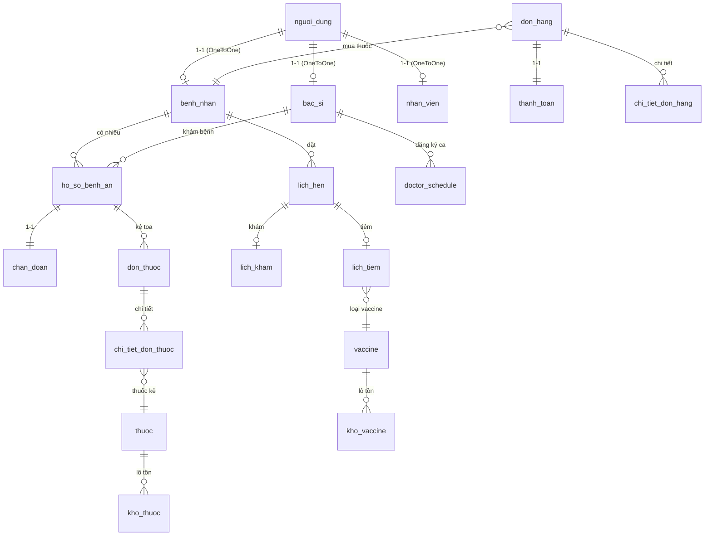

# 🏥 PhòngKhám+ — Hệ thống Quản lý Phòng khám Y tế Toàn diện

**PhòngKhám+** là giải pháp phần mềm quản trị phòng khám đa khoa hiện đại, tích hợp toàn diện các phân hệ nghiệp vụ từ Tiếp đón, Khám bệnh, Kê đơn, Tiêm chủng, Bán thuốc, Kho dược, Kế toán tài chính đến Chăm sóc khách hàng. 

Hệ thống được thiết kế theo mô hình **Single Page Application (SPA)** trực quan ở Frontend, kết hợp sức mạnh bảo mật và xử lý logic mạnh mẽ của **Django REST Framework** ở Backend, hỗ trợ chạy mượt mà trên môi trường mạng nội bộ (LAN) cũng như triển khai Cloud.

---

## 🚀 Tính năng nổi bật theo Vai trò (Multi-Role)

Hệ thống phân quyền sâu sắc dựa trên tài khoản người dùng (`NguoiDung`) mở rộng theo mô hình 1-1 với 7 vai trò cốt lõi:

```
[Người dùng hệ thống]
       │
       ├─► Bệnh nhân (BN...)  ──► Đặt lịch, Xem hồ sơ bệnh án, Xem lịch sử tiêm, Mua thuốc
       ├─► Bác sĩ (BS...)     ──► Khám bệnh, Kê đơn, Tiêm chủng, Đăng ký ca làm việc
       ├─► Lễ tân (NV...)     ──► Đón tiếp walk-in, Xếp hàng chờ khám/tiêm, Phân phối bác sĩ
       ├─► Quản lý kho (NV...) ──► Quản lý lô dược phẩm/vaccine (HSD, Số lô), Nhập/Xuất kho (FIFO)
       ├─► Bán thuốc (NV...)   ──► Bán thuốc lẻ/Toa thuốc bác sĩ, Quản lý hóa đơn tại quầy
       ├─► Kế toán (NV...)    ──► Thu phí dịch vụ/đơn thuốc, Báo cáo tài chính & doanh thu
       └─► Admin (ADMIN)      ──► Quản trị tài khoản, Phân quyền hệ thống, Tra cứu Audit Logs
```

### 1. 🧑‍⚕️ Phân hệ Bác sĩ (Khám bệnh & Tiêm chủng)
*   **Quản lý lịch khám:** Tra cứu danh sách lịch hẹn trong ngày (hỗ trợ lọc nhanh, hiển thị thông tin trực quan, tự động ẩn lịch đã hoàn thành).
*   **Hồ sơ bệnh án & Chẩn đoán:** Tạo và cập nhật hồ sơ bệnh án chi tiết (triệu chứng lâm sàng, chỉ số sinh tồn). Tích hợp chẩn đoán theo mã chuẩn hóa **ICD-10**.
*   **Kê đơn dược phẩm:** Giao diện kê đơn tối ưu, cho phép kê đơn từ danh mục thuốc tồn kho của phòng khám hoặc đánh dấu mua ngoài (`la_thuoc_mua_ngoai`). Hỗ trợ áp dụng toa thuốc mẫu.
*   **Nghiệp vụ Tiêm chủng chuyên sâu:**
    *   Hỗ trợ khám sàng lọc trước tiêm, ghi chú tình trạng sức khỏe và phản ứng sau tiêm.
    *   **Hủy tiêm / Chống chỉ định:** Cập nhật trạng thái lịch tiêm sang hủy, lưu hồ sơ chống chỉ định và **không trừ kho vaccine**.
    *   **Xác nhận đã tiêm (`DA_TIEM`):** Tự động gọi API trừ kho vaccine 1 liều theo cơ chế **FIFO (First In, First Out)** của lô hàng nhập trước còn hạn sử dụng.
*   **Đăng ký ca làm việc (Doctor Schedule):** Bác sĩ chủ động đăng ký ca trực tuần trực tiếp trên dashboard cá nhân theo 3 ca:
    *   **Ca Sáng:** 06:00 – 11:59
    *   **Ca Chiều:** 12:00 – 17:59
    *   **Ca Tối:** 18:00 – 21:59

### 2. 👩‍💼 Phân hệ Lễ tân (Tiếp nhận & Điều phối)
*   **Tiếp đón Walk-in:** Hỗ trợ bệnh nhân vãng lai đăng ký trực tiếp tại quầy. Lễ tân lựa chọn dịch vụ **Khám bệnh** hoặc **Tiêm chủng** (đối với Tiêm chủng, hệ thống bắt buộc chọn loại vaccine cần tiêm để kiểm tra tồn kho và xếp lịch).
*   **Hàng chờ thông minh:** Bảng theo dõi hàng chờ hiển thị thời gian thực, phân loại rõ ràng trạng thái và loại hình dịch vụ khám/tiêm.
*   **Phân công Bác sĩ linh hoạt:** Bộ lọc thông minh chỉ hiển thị danh sách bác sĩ **đang trong ca trực** (được đối chiếu thời gian thực với bảng đăng ký ca trực `doctor_schedule`), tránh tình trạng gán nhầm bác sĩ đã nghỉ hoặc hết ca.

### 3. 📦 Phân hệ Kho dược & Vaccine
*   **Quản lý theo lô & HSD:** Toàn bộ dược phẩm và vaccine được theo dõi chi tiết theo từng lô sản xuất (`lo_sx`), ngày nhập kho (`ngay_nhap`), và hạn sử dụng (`han_su_dung`).
*   **Cơ chế trừ tồn tự động (FIFO):**
    *   Hệ thống tự động xuất kho theo phương pháp nhập trước - xuất trước đối với các lô hàng còn hạn sử dụng.
    *   Áp dụng kỹ thuật khóa dòng DB (`select_for_update`) tại thời điểm trừ kho để chống tranh chấp dữ liệu (Race Condition) khi nhiều bác sĩ xác nhận tiêm/kê đơn cùng lúc.
*   **Quản lý phiếu nhập kho:** Tạo và duyệt phiếu nhập kho (`phieu_nhap_kho`), tự động cập nhật số lượng tồn kho sau khi được phê duyệt.

### 4. 💵 Phân hệ Kế toán & Bán thuốc
*   **Thanh toán hóa đơn:** Hỗ trợ thu phí lịch hẹn khám, lịch tiêm chủng, đơn thuốc tại quầy bằng tiền mặt hoặc thanh toán trực tuyến qua cổng **VNPAY Sandbox**.
*   **Báo cáo tài chính:** Thống kê doanh thu phòng khám theo ngày, tháng, năm; biểu diễn biểu đồ trực quan xu hướng doanh thu và số lượng bệnh nhân.
*   **Tích hợp màn hình Kho:** Phân quyền cho phép kế toán theo dõi trực quan trạng thái kho thuốc/vaccine để đối soát tài chính kịp thời.

### 5. 🏥 Phân hệ Bệnh nhân & Admin
*   **Bệnh nhân:** Đăng ký tài khoản trực tuyến, theo dõi tiến độ lịch hẹn, xem lại chi tiết bệnh án điện tử, lịch sử mũi tiêm chủng, và thanh toán hóa đơn online tiện lợi.
*   **Admin:** Quản trị toàn bộ nhân sự, danh mục thuốc, hệ thống thiết lập, gửi thông báo in-app hàng loạt (`thong_bao_app`) và kiểm tra vết **Audit Logs (`nhat_ky_hoat_dong`)** ghi nhận mọi thao tác nhạy cảm (Thêm/Sửa/Xóa, IP truy cập, User Agent thiết bị).

---

## 🛠️ Công nghệ Sử dụng

### 1. Backend (be/)
*   **Ngôn ngữ:** Python 3.10+
*   **Framework chính:** Django 4.2+ & Django REST Framework (DRF)
*   **Cơ sở dữ liệu:** MySQL 8.0 (hỗ trợ lưu trữ tiếng Việt utf8mb4, tối ưu khóa ngoại)
*   **Xử lý thời gian thực:** Django Channels (WebSockets) cho hệ thống chat tư vấn và thông báo đẩy.
*   **Xử lý bất đồng bộ:** Celery & Redis dùng cho các tác vụ gửi tin nhắn SMS, Email thông báo lịch hẹn, và tính toán báo cáo định kỳ.
*   **Bảo mật:** JWT Authentication (`djangorestframework-simplejwt`) với cơ chế xoay vòng token (Rotate Refresh Tokens) và danh sách đen (Blacklist).
*   **Tích hợp bên thứ ba:** Cổng thanh toán VNPAY (IPN & Return URL), Gateway SMS eSMS.vn gửi tin nhắn xác nhận.

### 2. Frontend (fe/)
*   **Kiến trúc:** Vanilla HTML5, CSS3 hiện đại (hỗ trợ giao diện sáng/tối - Light/Dark Theme, Responsive co giãn trên thiết bị di động).
*   **Logic ứng dụng:** Vanilla Javascript (SPA Engine tự phát triển dựa trên cơ chế nạp trang động qua API, quản lý phiên qua `localStorage` và bảo mật CSRF Token).
*   **Thư viện đồ họa:** FontAwesome 6, Chart.js cho biểu đồ kế toán.

---

## 📊 Thiết kế Cơ sở Dữ liệu

Cơ sở dữ liệu của hệ thống bao gồm hơn 40 bảng nghiệp vụ, được quản lý nhất quán thông qua Django ORM. Dưới đây là sơ đồ quan hệ thực thể (ERD) tóm tắt các thực thể chính:



### Quy tắc đặt mã định danh tự động trong hệ thống:
*   **Bệnh nhân:** `BN{YYYY}{0001}` (Ví dụ: `BN20260001`)
*   **Bác sĩ:** `BS{YYYY}{0001}` (Ví dụ: `BS20260001`)
*   **Nhân viên:** `NV{YYYY}{0001}` (Ví dụ: `NV20260001`)
*   **Hồ sơ bệnh án:** `HS{YYYYMM}{0001}` (Ví dụ: `HS2026050001`)
*   **Lịch tiêm chủng:** `TC{YYYY}{000001}` (Ví dụ: `TC2026000001`)
*   **Lịch hẹn:** `LH{YYMM}{0001}` (Ví dụ: `LH26050001`)

---

## 💻 Hướng dẫn Cài đặt & Khởi chạy nhanh

### 1. Chuẩn bị môi trường
Yêu cầu máy chủ đã cài đặt **Python 3.10+**, **MySQL server**, và **Redis server** (để chạy Chat/Celery).

### 2. Thiết lập dự án
1.  **Clone mã nguồn** và di chuyển vào thư mục dự án.
2.  **Khởi tạo môi trường ảo Python & cài đặt dependencies:**
    ```bash
    python -m venv venv
    # Trên Windows:
    venv\Scripts\activate
    # Trên Linux/macOS:
    source venv/bin/activate
    
    pip install -r requirements.txt
    ```

3.  **Cấu hình biến môi trường (`.env`):**
    Copy file mẫu từ `be/.env.example` thành `be/.env` và điền đầy đủ các thông số:
    ```ini
    DJANGO_SECRET_KEY=your-secret-key
    DJANGO_DEBUG=True
    DJANGO_ALLOWED_HOSTS=localhost,127.0.0.1
    
    # Cấu hình CSDL MySQL
    DB_NAME=phongkham
    DB_USER=root
    DB_PASSWORD=your_password
    DB_HOST=127.0.0.1
    DB_PORT=3306
    ```

4.  **Tạo CSDL & Khởi chạy Migrations:**
    Hãy chắc chắn rằng bạn đã tạo một database trống tên là `phongkham` trong MySQL Server trước khi chạy lệnh:
    ```bash
    cd be
    python manage.py migrate
    ```

5.  **Tạo tài khoản quản trị tối cao (Admin):**
    ```bash
    python manage.py createsuperuser
    ```
    *(Nhập tên đăng nhập, email, và mật khẩu quản trị).*

6.  **Khởi chạy Server phát triển:**
    ```bash
    python manage.py runserver
    ```
    Mở trình duyệt truy cập: `http://127.0.0.1:8000/login/`

---

## 🌐 Triển khai nội bộ mạng LAN (Local Area Network)

Hệ thống được tối ưu hóa để vận hành theo mô hình **1 Server Trung Tâm** đặt tại phòng máy và các **Client (máy trạm)** của Lễ tân, Bác sĩ, Kế toán, Kho truy cập trực tiếp qua trình duyệt web trong cùng mạng LAN.

Chi tiết các bước thiết lập nhanh:

1.  **Cấu hình IP Tĩnh trên máy chủ Server:**
    Ví dụ đặt IP tĩnh máy chủ là: `192.168.1.10`
2.  **Cấu hình Firewall trên Server:**
    Mở cổng TCP `8000` (Inbound Rules) trên Windows Defender Firewall hoặc UFW (Linux) để các máy trạm có thể gửi yêu cầu đến.
3.  **Cập nhật cấu hình `.env` trên Server:**
    ```ini
    DJANGO_ALLOWED_HOSTS=localhost,127.0.0.1,192.168.1.10
    DJANGO_CSRF_TRUSTED_ORIGINS=http://192.168.1.10:8000
    DJANGO_CORS_ALLOWED_ORIGINS=http://192.168.1.10:8000
    ```
4.  **Khởi động Server LAN bằng Daphne (ASGI Production Web Server):**
    Chạy tệp batch tự động được thiết lập sẵn trong thư mục `be/`:
    ```bash
    start_lan_server.bat 0.0.0.0 8000
    ```
    *Tệp lệnh này sẽ tự động thu thập tài nguyên tĩnh (`collectstatic`) và chạy Daphne ASGI server để hỗ trợ kết nối WebSockets ổn định cho phòng chat nội bộ và thông báo đẩy.*
5.  **Truy cập trên các máy trạm (Client):**
    Mở Chrome/Edge trên máy trạm và gõ địa chỉ: `http://192.168.1.10:8000`

> 📘 Chi tiết về sơ đồ mạng, kiểm thử tải và checklist xử lý sự cố LAN được trình bày chi tiết tại tệp hướng dẫn chuyên biệt [DEPLOY_LAN.md](DEPLOY_LAN.md).

---

## 🧪 Tài liệu Kỹ thuật & Nghiệp vụ Liên quan

Để hiểu sâu hơn về kiến trúc kỹ thuật, quy trình thiết lập, và lịch sử cải tiến dự án, vui lòng đọc thêm các tài liệu đi kèm:
*   [docs/setup.md](docs/setup.md) — Hướng dẫn chi tiết từng bước cài đặt MySQL, Redis, thiết lập biến môi trường `.env`, khởi tạo migrations, chạy Daphne ASGI Server và Celery Workers.
*   [CO_SO_DU_LIEU.md](CO_SO_DU_LIEU.md) — Chi tiết cấu trúc Schema CSDL, định dạng cột và DDL tham khảo của toàn bộ ~50 bảng nghiệp vụ.
*   [TONG_KET_PHIEN_LAM_VIEC.md](TONG_KET_PHIEN_LAM_VIEC.md) — Tổng hợp chi tiết các đợt cập nhật lớn của hệ thống (Luồng tiêm chủng mới, cơ chế trừ tồn vaccine FIFO, logic phân ca của Bác sĩ, Walk-in gán ca trực đầu cuối).
*   [DEPLOY_LAN.md](DEPLOY_LAN.md) — Hướng dẫn cấu hình mạng nội bộ LAN, checklist bàn giao thiết bị đầu cuối cho các phòng ban tại phòng khám.

---
*Hệ thống được phát triển và vận hành tối ưu trên nền tảng Django REST & Vanilla JS.*

